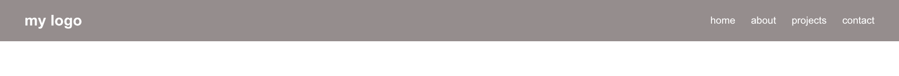
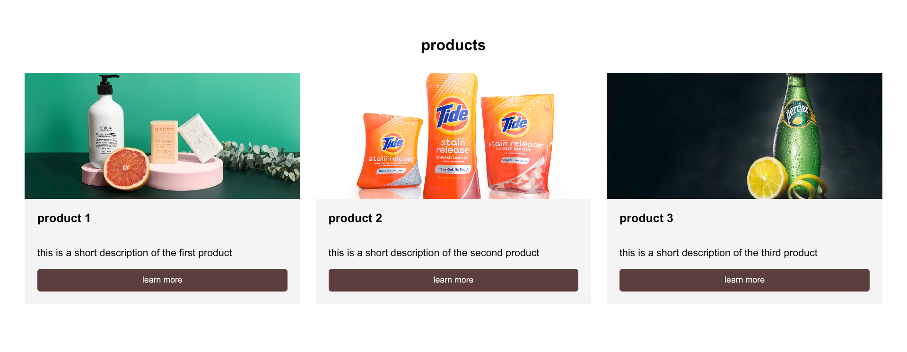
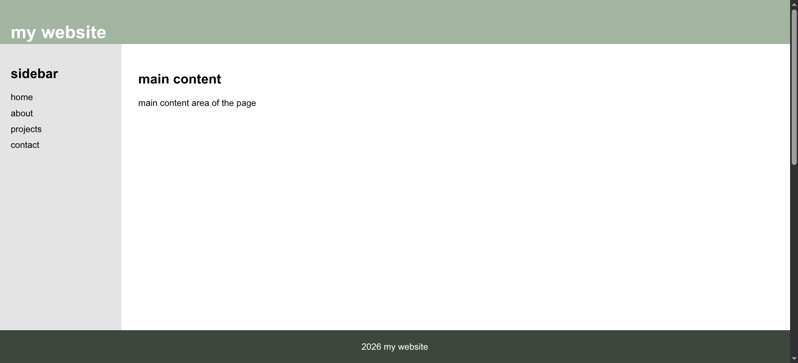
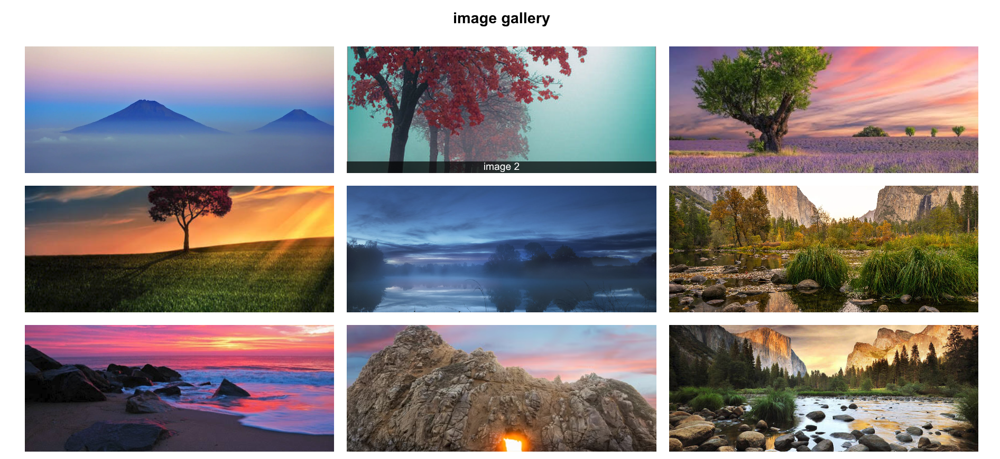
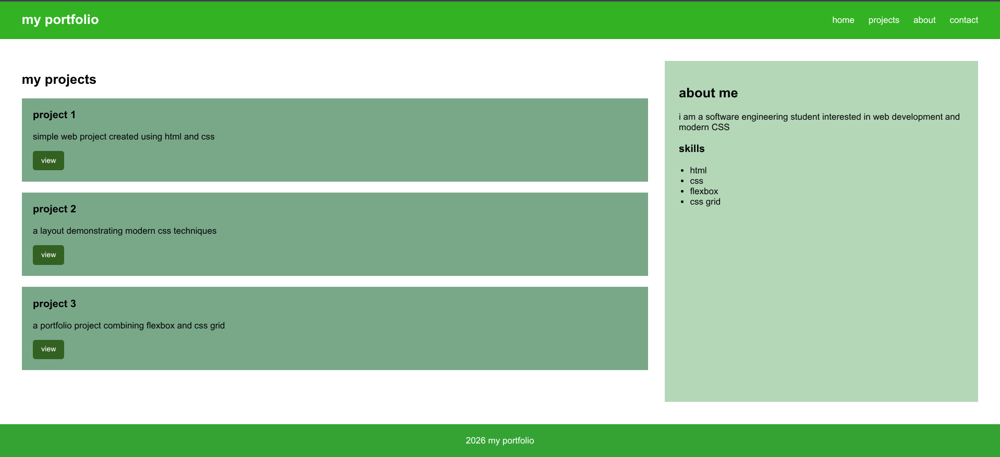

# Assignment 2 - Advanced CSS

Name: Aldiyar Kairollin

Group: SE-2539

## Part 1 - Flexbox

### Task 0 - Navigation Bar

Implemented a navigation bar using css flexbox.
The logo is placed on the left and navigation links on the right.
The links are spaced using gap and vertically centered using align-items: center.

### Task 1 - Card Row

Created three cards using flexbox.
Each card contains an image, title, description and button.
The cards have equal width, consistent spacing and a hover effect.

## Part 2 - Grid System

### Task 2 - Page Layout with Grid Areas

Created a page layout using css grid with a header, sidebar, main content and footer.
The layout uses grid-template-areas to position each section.

### Task 3 - Image Gallery

Created a gallery containing nine images using css grid.
The gallery uses three equal-width columns and consistent gaps.
Captions appear when the user hovers over an image.

## Part 3 - Combining Flexbox & Grid

### Task 4 - Portfolio Page

Created a portfolio page combining css grid and flexbox.
The main section uses Grid to divide projects and the sidebar.
Flexbox is used for the navigation and project cards.

## Summary

In this assignment, i practiced using css flexbox and grid to create structured layouts. I worked with alignment, spacing, grid areas, columns, rows, hover effects, and combining flexbox with grid.